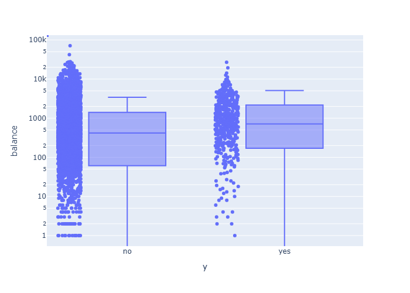
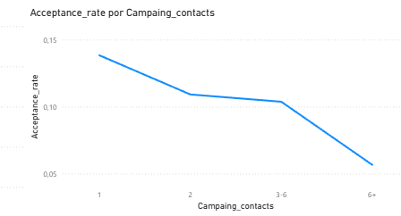

# Bank Marketing DataSet Analysis

## Objective

Analyze a bank marketing dataset to identify which customer segments are more likely to accept a marketing campaign.

## Source of Data

Source: https://www.kaggle.com/datasets/kevalm/bank-marketing-dataset?resource=download

This dataset contains information from a bank marketing campaign. The dataset contains information job, age, marital state, education, balance of money, contact channel, number of contacts previous, time of contact and the result of communication.

## Process

- Data review and cleaning
- Review percentage of failure and acceptance. Explore posible diferences between the two groups.
- Grouping information by job, marital status, education, contact channel and others, and see what profiles are best to obtain acceptance.

## Key Insights

- Only 11.5% of clients accepted the campaign (highly imbalanced dataset)
- Clients with higher balances are associated with higher acceptance levels
- Most conversions come from:
  - Married clients
  - Customers with secondary education
  - Contacts made via cellphone

## Results

According to Fig 1, we can see that only 11.5% of contacts in the campaign accepted. Furthermore, we can see a difference between the groups (acceptance and no acceptance) in balance terms. On average, those who accepted the campaign have more money than those who did not. Statistically, both groups are different (H = 28.196, p-value = 1.096e-7). Results of Kruskal-wallis test

  
  

  <em>
    Fig1. (a) Percentage of clients that accepted the campaign vs. that didn't accept. (b) Comparison of money balance between the clients that accepted the campaign and that didn't.
  </em>

Between the clients who accepted the campaign, 47.02% have secondary education, 53.17% are married, and 79.80% were contacted via cellphone. These segments represent the largest share of converted clients.

However, a higher share of conversions does not necessarily imply higher effectiveness. When analyzing conversion rates, different segments show stronger performance: retired clients have a conversion rate of 23%, clients with tertiary education reach 14%, and divorced clients 15%. The difference between cellphone and telephone contact is minimal (around 1%).

These results should be interpreted with caution, as some segments contain fewer observations, which may lead to less stable conversion rates.

Finally, we found that the conversion rates decreases according to number of contacts with the client during the campaign (see Fig 2).

  

  <em>
    Fig2. Conversion Ratio per number of contacts in campaign.
  </em>

## Conclusions

- Clients with higher balances tend to show higher conversion rates.

- Married clients and those with secondary education represent a large share of total conversions; however, this does not necessarily imply higher effectiveness compared to other segments.

- Conversion rates decrease as the number of contacts with a client increases, indicating diminishing returns from repeated contact attempts.

## Recomendations

- Prioritize customer segments with higher conversion rates, such as retired clients and those with tertiary education, as they show stronger effectiveness despite representing a smaller share of the dataset.

- Focus on optimizing the first contact with customers, as conversion rates decrease significantly with repeated contact attempts, indicating diminishing returns.

- Maintain the use of cellphone as a primary contact channel, as it represents a large share of successful conversions, although differences in effectiveness compared to other channels are limited.

- Consider customer financial capacity (balance) as a relevant factor, since clients with higher balances tend to show better conversion performance.

- Interpret results carefully for segments with low representation, as small sample sizes may lead to unstable conversion rates.

## Notes

The analysis was performed using Python for data processing and exploratory analysis, and Power BI for interactive data visualization and dashboard development.