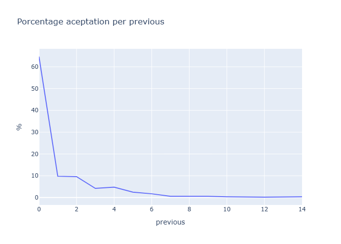

# Bank Marketing DataSet Analysis

## Objective

Analize a bank marketing dataset to identify the clients profile that has a best probability of acceptation in the present 
commercial campaign.

## Source of Data

Source: https://www.kaggle.com/datasets/kevalm/bank-marketing-dataset?resource=download

Dataset that represents data of  a comercial campaign of marketing. The dataset contains information job, age, marital state, education, balance of money, contact channel, number of contacts previous, time of contact and the result of communication.

## Process

- Data review and cleaning
- Review porcentage of failure and aceptation. Explore posible diferences between the two groups.
- Grouping information by job, marital state, education, contact channel and others, and see what profiles are best to obtain aceptation.

## Results

According to Fig 1, we can see that only 11.5% of contacts in the campaign accepted. Furthermore, we can see a difference between the groups (acceptation and no aceptation) in balance terms. On average, those who accepted the campaign have more money than those who did not. Statistically, both groups are different (H = 28.196, p-value = 1.096e-7. Results of Kruskal-wallis test)

  
  

  <em>
    Fig1. (a) Porcentage of clients that accepted the campaign vs. that didn't accept. (b) Comparation of money balance between the clients that accepted the campaign and that didn't.
  </em>

Between the clients that accepted the campaign, we found that 47.02% has a secondary education, 53.17% are married and 79.80% were contacted by cellphone. They were the most favorable profiles because in its categories represents the major porcentages.

Finally, The results indicate that the highest probability of conversion occurs on the first contact with the customer. From the second attempt onward, the campaign's effectiveness decreases significantly, showing a lower return on repeat contacts. (see Fig 2). 

  

  <em>
    Fig2. Porcentage of conversion vs number of previous contacts
  </em>

## Conclusions

- The best channel of contact of clients is the cellphone
- Clients with more money has higher probability of accept the campaign. In the same way, clients with married state and secondary education can increase the probability.
- If clients is contacted repeatedly, the campaign's effectiveness decreases.

## Recomendations

For future campaigns, it is recommended to prioritize customers with a married profile, secondary education, and higher economic capacity, since these segments show a greater participation in conversions.
